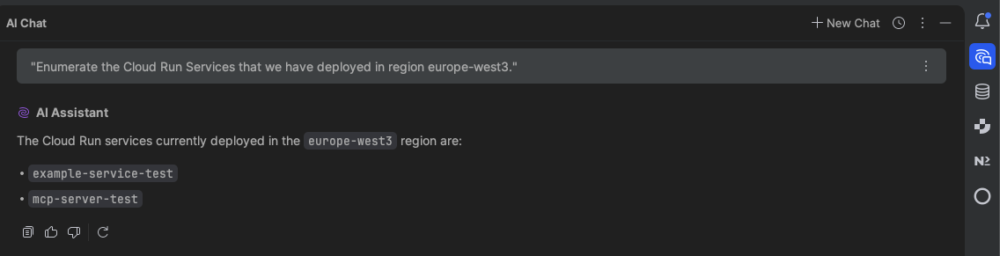
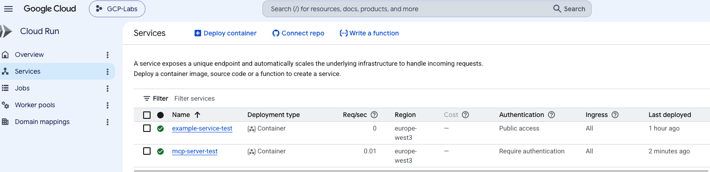
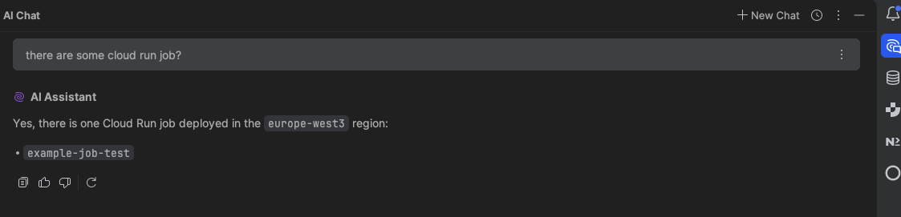
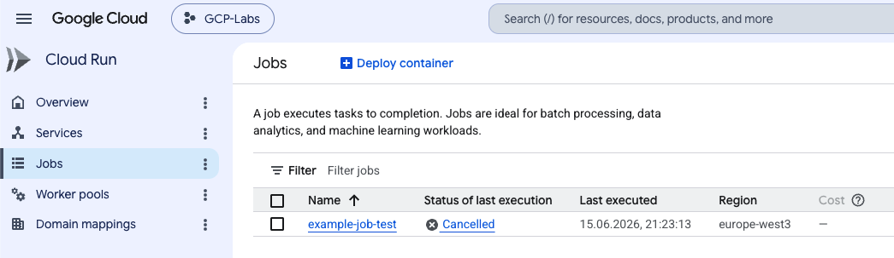
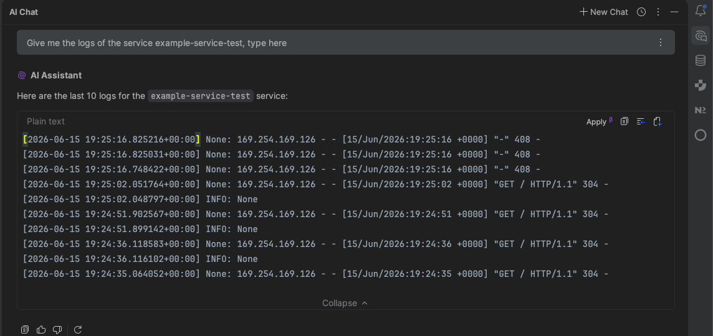
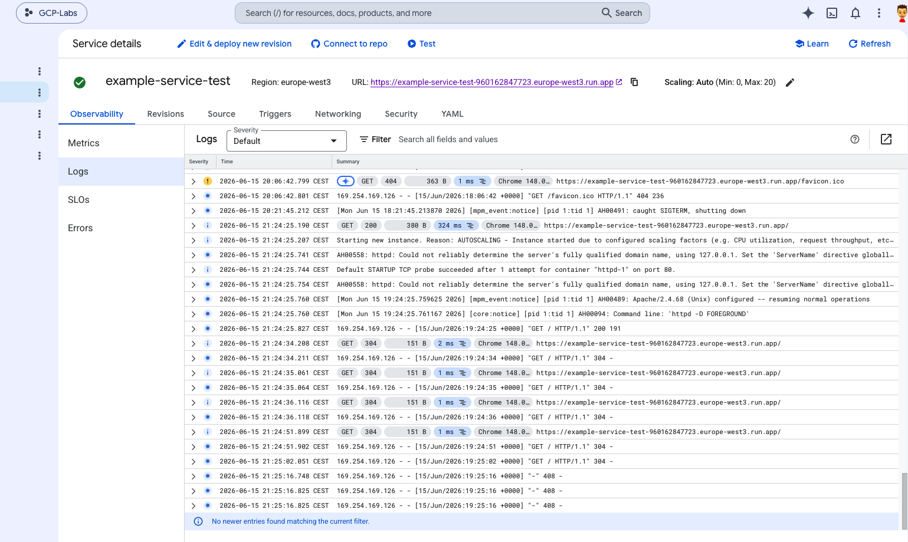
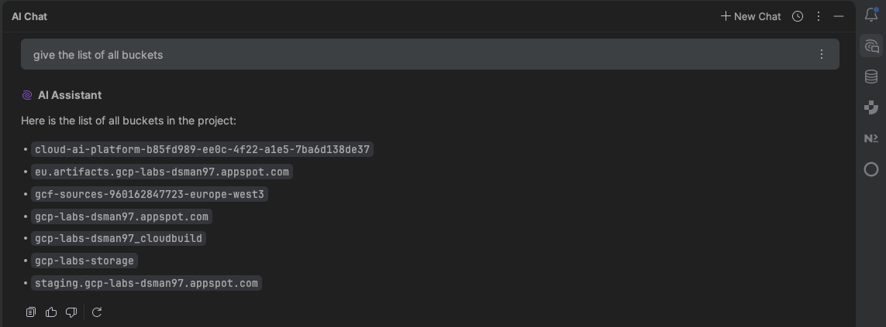
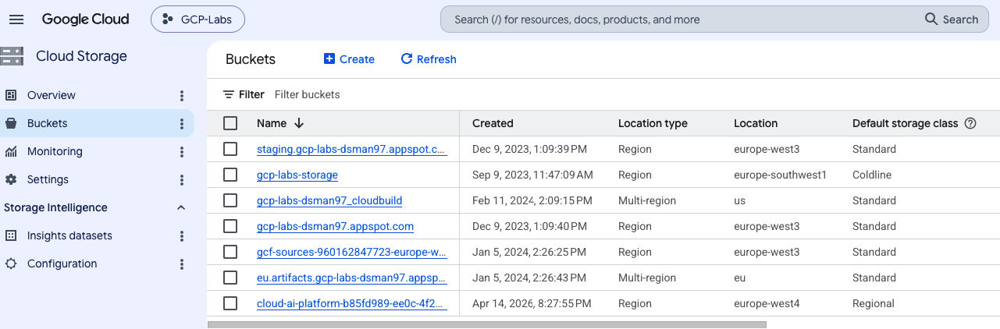

# MCP-Cloud

This project is designed to empower **DevOps teams** to easily deploy their own **Model Context Protocol (MCP)** servers within their own cloud infrastructure (such as GCP, AWS, or Azure). 

By providing standardized infrastructure-as-code (Terraform), we enable **development teams** to be more agile, allowing them to integrate AI models with their cloud resources securely and efficiently.

## Project Vision

As a **GCP Specialist**, the initial focus of this repository is on Google Cloud Platform. However, support for other major cloud providers like **AWS** and **Azure** will be added as soon as possible to provide a truly multi-cloud MCP deployment framework.

## Security Recommendation

This project is highly recommended for **development-oriented environments**. To maintain a secure posture, it is strongly advised to configure these MCP servers with **read-only permissions** whenever possible. This ensures that the AI models can access the necessary context without the risk of unintended modifications to your infrastructure.

## Current Support: GCP

The current implementation provides a complete Terraform setup for GCP, including:
- **IAM:** Least-privilege Service Account configuration.
- **Cloud Run:** Serverless deployment of the MCP server.
- **Automated Container Build:** Integration to build and push the Docker image.

### Getting Started (GCP)

1. Navigate to `gcp-mcp-server/terraform`.
2. Copy `terraform.tfvars.example` to `terraform.tfvars`.
3. Fill in your `project_id` and other variables.
4. Run `terraform init` and `terraform apply`.

## Architecture & Flow

Below you can find the visual representation of how the MCP Server works within GCP, interleaving the user perspective with the infrastructure components.

### Step 1: Request Initialization



### Step 2: Context Gathering



### Step 3: Model Interaction



### Step 4: Final Response



## Local Development & Interaction

To interact with the deployed MCP server locally, development teams must use a secure connection. I recommend using the **Google Cloud Auth Proxy** (or `gcloud` authentication) to ensure all interactions remain secure and authenticated.

### Steps to connect locally:

1. **Install Google Cloud SDK:**
   Ensure you have the `gcloud` CLI installed and configured.

2. **Authenticate with GCP:**
   ```bash
   gcloud auth login
   gcloud config set project YOUR_PROJECT_ID
   ```

3. **Obtain an Identity Token:**
   Since the Cloud Run service is protected, you need a token to call it.
   ```bash
   export MCP_TOKEN=$(gcloud auth print-identity-token)
   ```

4. **Connect via Proxy / Local Interaction:**
   You can now use this token to interact with the MCP server URL. If you are using a specific client that supports MCP, configure it to include the `Authorization: Bearer $MCP_TOKEN` header.

   *Note: For a more seamless local experience, you can run a local proxy that injects the authentication headers automatically.*

## IDE Configuration

For detailed instructions on how to integrate the MCP servers with your favorite IDE, please refer to the documentation in the `gcp-mcp-server` directory:

- **JetBrains (PyCharm, IntelliJ, etc.):** [English](gcp-mcp-server/docs/JETBRAINS-SETUP-EN.md) | [Spanish](gcp-mcp-server/docs/JETBRAINS-SETUP-ES.md)
- **VS Code:** [English](gcp-mcp-server/docs/VSCODE-SETUP-EN.md) | [Spanish](gcp-mcp-server/docs/VSCODE-SETUP-ES.md)

---

*Note: More cloud providers and features coming soon!*
